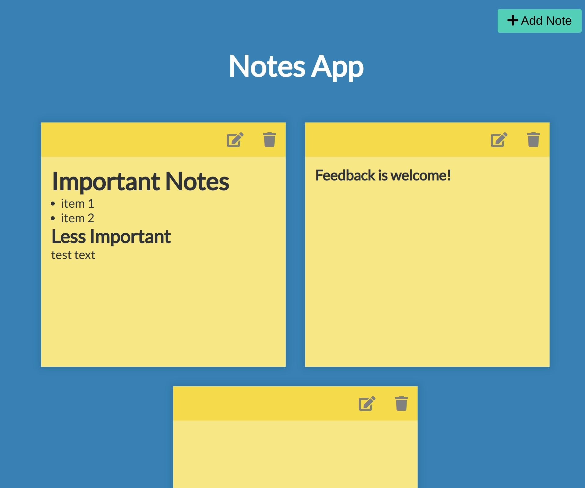

# Notes App
A simple Notes App made with Vanilla Javascript & [Marked JS](https://github.com/markedjs/marked) 
If you find this useful please give this repository a star :star:

# Demo
[Notes App](https://mannar.ch/projects/notes/index.html) 

# Features

1. Add, edit, delete Notes
2. Notes are saved after closing broswer (LocalStorage)
2. Markdown language is suppoted

# Run
Open `index.html` in browser.
